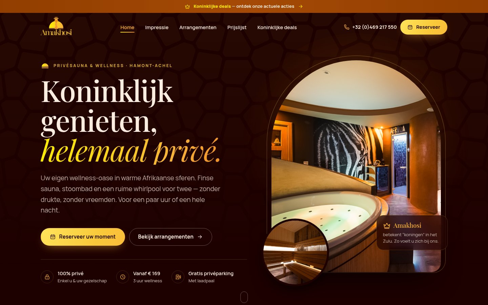

# Amakhosi — nieuw websitedesign (amakhosi.be)

Nieuw design voor **Amakhosi, privésauna & wellness in Hamont-Achel**, gebouwd als
paste-ready code voor GoHighLevel. We starten met de **homepage**; de andere pagina's
volgen in hetzelfde systeem (zelfde `styles.css` en `scripts.js`).

Volledige previews: [desktop](previews/homepage-desktop.jpg) · [mobiel](previews/homepage-mobile.jpg)

---

## 1. Designbrief

De huisstijl van Amakhosi blijft het vertrekpunt: het **logo** (giraffe met kroon voor
een opkomende zon), de **donkere, warme basis** van de huidige site (ebbenhout `#1d0000`
en cacao `#331802`), **goud** (`#e0bb02` / logo-goud `#d6a833`), het **zon-verloop** uit
het logo (`#ffec03` → `#fbb239`), **roest** `#913e00` en **crème** `#fefaf0` / **perzik**
`#ffeedd`. Typografie blijft **Playfair Display** (titels, verwant aan het logo) met
**Manrope** (tekst en knoppen). Nieuw is dat de merkmotieven echt terugkomen in de
vormgeving: de **halve zon** als boogvormige fotokaders en als teken bij elke sectietitel,
de **kroon** bij de belangrijkste accenten en het **giraffepatroon** als subtiele textuur
en als bewegende band met de faciliteiten. Het geheel voelt als een warme, kaarslicht-achtige
avond in een Afrikaanse lodge: luxueus, intiem en helemaal privé.

## 2. Pagina's

| Pagina | URL (ongewijzigd) | Status | Doel |
|---|---|---|---|
| Home | `/` | ✅ klaar (deze PR) | Eerste indruk, faciliteiten, prijzen, vertrouwen → reserveren |
| Impressie | `/privesauna-wellness-impressie` | ⏳ volgende | Sfeerfoto's per ruimte + verhaal van Patrick & Connie |
| Arrangementen | `/arrangementen` | ⏳ volgende | Faciliteiten, romantisch pakket, ontbijt, dranken, planken |
| Prijslijst | `/prijslijst` | ⏳ volgende | Wellness 3/4/5 uur + overnachtingen, duidelijke CTA per prijs |
| Koninklijke deals | `/koninklijke-deals` | ⏳ volgende | Tijdelijke en vaste acties |
| Reserveren | `/reserveren` | ⏳ volgende | GHL-kalender in de nieuwe huisstijl |

De bestaande URL's blijven behouden zodat de vindbaarheid in Google niet verloren gaat.

### Opbouw homepage

1. **Topbalk** met Koninklijke deals
2. **Navigatie** (sticky) met telefoonnummer en knop *Reserveer*
3. **Hero** — "Koninklijk genieten, helemaal privé." met boogfoto, sauna-inzet en de betekenis van *Amakhosi*
4. **Giraffe-band** met alle faciliteiten
5. **Welkom** — het verhaal, citaat van Patrick & Connie, kerncijfers
6. **Faciliteiten** — bento-raster met whirlpool, sauna, stoombad, douche, lounge, slaapsuite
7. **Arrangementen & prijzen** — tabs *Wellness* / *Overnachting* met de echte prijzen
8. **Extra's** — romantisch pakket, bubbels, planken, ontbijt
9. **Zo werkt het** — 3 stappen naar een reservering
10. **Reviews** — plek voor de GHL-reviewswidget (zie *Nog aan te vullen*)
11. **FAQ** — veelgestelde vragen (ook als FAQ-schema voor Google)
12. **Reserveren & contact** — slot-CTA, gegevens en kaart
13. **Footer** + **mobiele reserveerbalk** onderaan het scherm

## 3. Bestanden

| Bestand | Inhoud |
|---|---|
| `styles.css` | Gedeelde stylesheet: kleuren, typografie, componenten, responsive, animaties |
| `scripts.js` | Gedeeld script (vanilla JS): sticky header, mobiel menu, smooth scroll, scroll-animaties, prijs-tabs, FAQ, mobiele CTA-balk |
| `index.html` | Homepage |
| `previews/` | Screenshots van het design (desktop, mobiel) |

Alle klassen beginnen met `amk-` en alle inhoud staat in `
`, zodat het
design niet botst met de eigen CSS van GoHighLevel. Foto's en logo worden rechtstreeks
geladen vanuit de bestaande GHL-mediabibliotheek van Amakhosi.

## 4. In GoHighLevel plakken

**Eenmalig (per website / funnel):**

1. Ga naar **Sites → Websites → Amakhosi → Settings**.
2. **Head tracking code**: plak de 3 regels voor de lettertypes uit `index.html`
   (de twee `preconnect`-regels en de Google Fonts-`<link>`).
3. **Custom CSS**: plak de volledige inhoud van `styles.css`.
4. **Body (footer) tracking code**: plak de inhoud van `scripts.js` tussen
   ``.

**Per pagina (hier: Home):**

5. Open de pagina in de builder en verwijder de oude secties (of maak een nieuwe pagina aan
   en zet die later als homepage).
6. Voeg één **Section** toe → **Full width**, padding en marges op **0**, geen achtergrond.
   Zet in de row/kolom ook alle padding op 0.
7. Voeg een element **Custom JS/HTML** toe en plak alles tussen
   `START GHL-PLAKBLOK` en `EINDE GHL-PLAKBLOK` uit `index.html`.
8. Zet de GHL-animaties van die sectie **uit** (een animatie op de sectie kan de vaste
   header laten meescrollen).
9. **Pagina-instellingen → SEO**: titel *Privésauna & Wellness Hamont-Achel | Amakhosi*
   en de meta-beschrijving uit `index.html` overnemen.
10. **Preview** op desktop en mobiel, en **Publish**.

> Tip: werk je liever zonder website-brede instellingen? Dan kun je `styles.css` ook binnen
> `` en `scripts.js` binnen `` in hetzelfde Custom
> JS/HTML-element plakken. Voor meerdere pagina's is de website-brede aanpak eenvoudiger.

## 5. Nog aan te vullen

- **Reviews**: plak de GHL-reviewswidget (*Reputation → Widgets*) in
  `.amk-reviews__widget` en verwijder de 3 placeholder-kaarten. Gebruik enkel echte reviews.
- **Socials**: de huidige site heeft nog placeholder-links voor Facebook/Instagram. Geef de
  echte URL's door, dan voegen we ze toe in de footer.
- **Foto's**: enkele originele foto's in de mediabibliotheek zijn zeer groot (tot 34 MB).
  Deze worden in het design niet gebruikt; upload bij voorkeur ook van de gebruikte foto's
  een versie van max. 1920 px breed (WebP/JPG ± 300 KB) voor een snellere laadtijd.
- **Badges** op de prijskaarten (*Meeste tijd voor u*, *Uitslapen tot 12 u*) zijn
  voorstellen en kunnen vrij aangepast worden.
