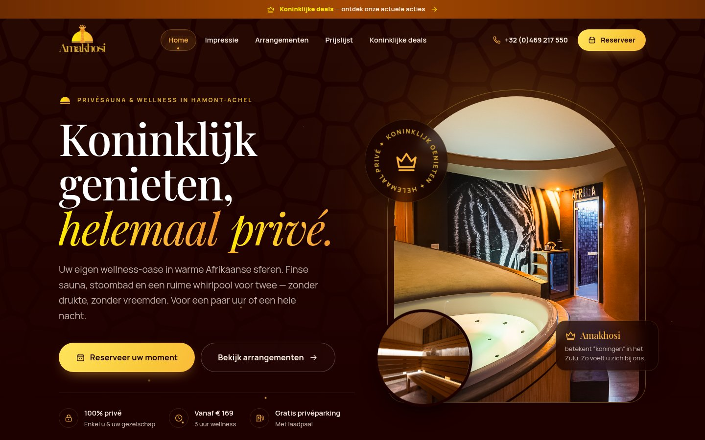

# Amakhosi — nieuwe website (amakhosi.be)

Volledige redesign van **Amakhosi, privésauna & wellness in Hamont-Achel**, als
paste-ready code voor GoHighLevel. De site houdt de **donkere stijl van de huidige
amakhosi.be** en de eigen huisstijl, en voegt een nieuwe navigatie, rijke animaties en
grondige SEO toe.



Previews: [home](previews/home-desktop.jpg) · [home mobiel](previews/home-mobile.jpg) ·
[mobiel menu](previews/mobile-menu.jpg) · [impressie](previews/impressie-desktop.jpg) ·
[arrangementen](previews/arrangementen-desktop.jpg) · [prijslijst](previews/prijslijst-desktop.jpg) ·
[deals](previews/deals-desktop.jpg) · [reserveren](previews/reserveren-desktop.jpg)

---

## 1. Design

- **Altijd donker**, net als de huidige site: ebbenhout `#1d0000`, diep `#140000` en
  cacao `#331802`, met warme gloed en de giraffetextuur voor ritme tussen de secties.
- **Huisstijl van Amakhosi**: het logo, goud (`#e0bb02` / `#d6a833`), het zonverloop uit het
  logo (`#ffec03` → `#fbb239`), roest `#913e00` en crème tekst. Lettertypes
  **Playfair Display** (titels) + **Manrope** (tekst).
- **Merkmotieven**: de halve zon (boogvormige foto's, zon-icoon bij elke titel, opkomende zon
  in de slotsecties), de kroon en het giraffepatroon (textuur + schuine bewegende band, zoals
  het lint uit de huisstijl).

### Nieuwe navigatie

- Bovenaan transparant over de hero; na scrollen wordt het een **zwevende capsule** met
  glas-effect en gouden rand, en het logo krimpt mee.
- **Glijdende markering** die je muis volgt over de menu-items; de actieve pagina krijgt een
  gloeiend puntje.
- Verdwijnt bij naar beneden scrollen en **komt terug bij naar boven scrollen**.
- **Gouden voortgangsbalk** bovenaan het scherm.
- Mobiel: knop *Menu* opent een volledig scherm-menu dat **als cirkel uit de knop openvouwt**,
  met genummerde links die één voor één inschuiven.

### Animaties

Alle animaties zijn vanilla JS/CSS, draaien soepel (enkel `transform`/`opacity`) en worden
uitgeschakeld bij *verminderde beweging* in het besturingssysteem.

| Animatie | Waar |
|---|---|
| Titels die **woord voor woord** opkomen | alle grote titels |
| **Boog-onthulling** + langzame zoom van de hero-foto | hero |
| **Gloeiende sintels** die opstijgen | hero en slotsecties |
| **Warm licht dat de cursor volgt** | hero |
| Draaiende **tekstring met kroon**, zwevend badge | hero |
| **Parallax** op foto's | hero, welkom, faciliteiten, features |
| **Wipe-onthulling** van foto's (van onder naar boven) | bento, features, galerij |
| **3D-tilt + gouden spotlight** onder de cursor | prijs-, extra-, deal- en infokaarten |
| **Magnetische** reserveerknoppen + **lichtschittering** | primaire knoppen |
| **Tellers** die oplopen (€ 0 → € 239) | prijskaarten |
| Lijn die zich **tekent** tussen de stappen | "zo werkt het" |
| **Zon die opkomt** achter de slot-CTA | onderaan elke pagina |
| Vloeiend open/dicht **FAQ** en glijdende **prijstabs** | FAQ, prijzen |
| **Lightbox** met pijltjestoetsen en swipen | galerij op Impressie |

## 2. Pagina's

| Pagina | URL (ongewijzigd) | Bestand | Inhoud |
|---|---|---|---|
| Home | `/` | `index.html` | Hero, faciliteiten, prijzen (tabs), extra's, 3 stappen, reviews, FAQ, contact + kaart |
| Impressie | `/privesauna-wellness-impressie` | `privesauna-wellness-impressie.html` | Verhaal van Patrick & Connie, 5 faciliteiten, comfort-extra's, fotogalerij met lightbox |
| Arrangementen | `/arrangementen` | `arrangementen.html` | Tijdlijn 3 uur → overnachting, alle faciliteiten, romantisch pakket, ontbijt, dranken, planken, snacks, FAQ |
| Prijslijst | `/prijslijst` | `prijslijst.html` | Wellness- en overnachtingsprijzen, vergelijkingstabel, extra's, FAQ |
| Koninklijke deals | `/koninklijke-deals` | `koninklijke-deals.html` | Deal-kaarten (in te vullen), altijd inbegrepen, contact + kaart |
| Reserveren | `/reserveren` | `reserveren.html` | De bestaande GHL-agenda in de nieuwe stijl, prijsoverzicht, goed om te weten, FAQ |
| Algemene voorwaarden | `/algemene-voorwaarden` | `algemene-voorwaarden.html` | Ontwerp met inhoudsopgave; gemarkeerde stukken nog in te vullen |
| Privacybeleid | `/privacybeleid` | `privacybeleid.html` | Ontwerp (AVG/GDPR) met inhoudsopgave; gemarkeerde stukken nog in te vullen |

De bestaande URL's blijven behouden, zodat de opgebouwde vindbaarheid in Google niet verloren gaat.

## 3. SEO

Per pagina:

- **Unieke title** (≤ 60 tekens) en **meta-beschrijving** (≤ 160 tekens) met de juiste
  zoektermen (privésauna, wellness, Hamont-Achel, overnachting, prijzen…).
- **Canonical**, `hreflang="nl-BE"`, robots-meta met grote beeldvoorbeelden.
- **Open Graph & Twitter**-kaarten met eigen deelafbeelding (met afmetingen en alt).
- **Lokale SEO**: geo-metatags met de exacte coördinaten, adres en telefoon (NAP) identiek op
  elke pagina, en een lijst van omliggende plaatsen (Pelt, Lommel, Bree, Peer, Budel, Weert,
  Eindhoven).
- **Eén H1** per pagina, logische koppenstructuur, beschrijvende alt-teksten, kruimelpad.
- **Snelheid**: hoofdbeeld wordt voorgeladen, `width`/`height` op elke afbeelding (geen
  verspringende layout), lazy loading, één CSS- en één JS-bestand, script met `defer`.

**Gestructureerde data (JSON-LD)** op elke pagina, automatisch uit dezelfde gegevens als de
pagina zelf: `DaySpa` (adres, geo, kaart, voorzieningen, prijsklasse, alle 5 arrangementen
als `Offer`), `WebSite`, `WebPage`, `BreadcrumbList`, plus `FAQPage` (home, arrangementen,
prijslijst, reserveren), `OfferCatalog` (prijslijst) en `ImageGallery` (impressie).

Ook meegeleverd: `sitemap.xml` (met afbeeldingen) en `robots.txt`.

## 4. Bestanden & bouwen

| Bestand / map | Inhoud |
|---|---|
| `styles.css` | Gedeelde stylesheet (alle pagina's) |
| `scripts.js` | Gedeeld script met navigatie en alle animaties (vanilla JS) |
| `*.html` | De 6 pagina's — **gegenereerd**, klaar om te plakken |
| `src/partials/` | Gedeelde stukken: iconen, header, footer, slot-CTA, mobiele balk |
| `src/pages/` | Inhoud per pagina |
| `build.py` | Bouwt de pagina's en de sitemap; bevat ook prijzen, FAQ's en SEO per pagina |
| `sitemap.xml`, `robots.txt` | SEO-bestanden |
| `assets/patroon/` | Het giraffepatroon als losse afbeelding (PNG + SVG) |
| `previews/` | Screenshots |

Iets aanpassen? Wijzig `src/` of de gegevens bovenaan `build.py` (prijzen, FAQ, titels) en
bouw opnieuw — prijzen, tabellen en de gestructureerde data blijven zo altijd gelijk:

```bash
python3 build.py
```

Lokaal bekijken (met nette URL's zoals `/prijslijst`):

```bash
npx serve .
```

Alle klassen beginnen met `amk-` en alle inhoud staat in `<div class="amk">`, zodat het
design niet botst met de eigen CSS van GoHighLevel. Foto's en logo komen rechtstreeks uit de
bestaande GHL-mediabibliotheek van Amakhosi.

## 5. In GoHighLevel plakken

**Eenmalig, voor de hele website** (*Sites → Websites → Amakhosi → Settings*):

1. **Head tracking code**: plak de lettertype-regels uit de `<head>` van `index.html`
   (de `preconnect`-regels en de Google Fonts-`<link>`).
2. **Custom CSS**: plak de volledige inhoud van `styles.css`.
3. **Body (footer) tracking code**: plak de inhoud van `scripts.js` tussen
   `<script>` en `</script>`.
4. Zet bij **Typografie** koptekst op *Playfair Display*, content op *Manrope*,
   tekstkleur `#FBEEE0` en linkkleur `#FBB239` (voor eventuele standaard GHL-elementen op
   een donkere achtergrond).

**Per pagina** (herhaal voor alle 6):

5. Open de pagina in de builder en verwijder de oude secties.
6. Voeg één **Section** toe → **Full width**, padding en marges op **0**, achtergrond
   `#1D0000`. Zet ook in de row en kolom alle padding op 0.
7. Voeg een element **Custom JS/HTML** toe en plak alles tussen
   `START GHL-PLAKBLOK` en `EINDE GHL-PLAKBLOK` uit het bijhorende `.html`-bestand.
8. Zet de GHL-animaties van die sectie **uit** (een animatie op de sectie laat de vaste
   navigatie meescrollen).
9. **Pagina-instellingen → SEO**: neem de `<title>`, meta-beschrijving en deelafbeelding
   (`og:image`) over uit de `<head>` van het `.html`-bestand.
10. **Preview** op desktop en mobiel, en **Publish**.

> Op de pagina **Reserveren** staat de bestaande GHL-agenda (`booking/amakhosi`) al in de
> code, inclusief het script dat de hoogte van de agenda automatisch aanpast.

## 6. Nog aan te vullen

- **Reviews** (home): plak de GHL-reviewswidget (*Reputation → Widgets*) in
  `.amk-reviews__widget` en verwijder de 3 placeholder-kaarten. Gebruik enkel echte reviews.
- **Koninklijke deals**: vervang de 2 voorbeeldkaarten door de echte acties (titel, uitleg,
  geldigheid) en verwijder het lint *Voorbeeld*.
- **Socials**: geef de echte Facebook/Instagram-links door, dan komen ze in de footer en in
  de gestructureerde data (`sameAs`).
- **Foto's**: enkele originele foto's zijn zeer groot (tot 34 MB) en worden niet gebruikt.
  Voor nog snellere laadtijden: upload van de gebruikte foto's versies van max. 1920 px breed
  (WebP/JPG ± 300 KB) en vervang de bestandsnamen in `src/` en `build.py`.
- **Badges** op de prijskaarten (*Meeste tijd voor u*, *Uitslapen tot 12 u*) zijn voorstellen.
- **Google Business-profiel**: zorg dat naam, adres en telefoon exact gelijk zijn aan de site
  (`Amakhosi`, `Watertorenstraat 64, 3930 Hamont-Achel`, `+32 469 21 75 50`).

## 7. Checklist GoHighLevel-agenda (feedback Patrick, oktober 2026)

Deze punten zitten in de GHL-instellingen van de agenda en e-mails, niet in de websitecode:

- [ ] **Overnachtingen tonen "4 hr"**: zet de duur van *Kom overnachten* op 14 uur en
  *Slaap lekker uit* op 16 uur. Test meteen of er nog tijdsloten om 20:00 verschijnen.
- [ ] **Telefoonnummer**: het veld neemt een Belgisch nummer aan; Nederlandse nummers werken
  alleen met +31. Zet in de instellingen van het telefoonveld (boekingsformulier) een
  landkeuze aan of schakel de strenge controle uit, als die optie er is.
- [ ] **Voorwaarden**: de tekst "privacybeleid en algemene voorwaarden" heeft geen link. Gebruik
  in het formulier het element *Algemene voorwaarden* en link naar `/algemene-voorwaarden` en
  `/privacybeleid`. Vul eerst de gemarkeerde stukken op die pagina's in (ondernemingsnummer,
  annuleringsregels, betaalprovider, bewaartermijn, datum) en verwijder het kader *Ontwerp*.
- [ ] **E-mails**: datum/tijd in 24-uursnotatie en in het Nederlands, het totaalbedrag na het
  €-teken (het gebruikte veld is nu leeg), en de aparte "purchase"-mail uitzetten.
- [ ] **Wellness-diensten**: beschrijvingen even uitgebreid maken als bij de overnachtingen en
  de namen gelijk zetten, bv. *(5 uur)* en *(6 uur)* i.p.v. *(5 uurtjes)*.

De website toont sinds deze versie dezelfde namen, prijzen (inclusief **Extra long stay, 6 uur,
€ 279**) en extra's als de agenda, de juiste duur van de overnachtingen (14 en 16 uur), een
vaste **Reserveer**-knop rechtsonder op de computer, een knop **Agenda op volledig scherm**
(handig op telefoons, ook voor de betaalpagina) en een tip voor Nederlandse telefoonnummers.

## 8. Giraffepatroon als afbeelding

| Bestand | Gebruik |
|---|---|
| `giraffe-patroon-donker-1920x1080.png` / `-2560x1440.png` | Donkere sectie-achtergrond (*Cover*) |
| `giraffe-patroon-donker-tegel.png` / `.svg` | Naadloze tegel, donker (*Repeat*, 260 px) |
| `giraffe-patroon-bruin-1920x1080.png` | Bruine variant zoals de faciliteitenband |
| `giraffe-patroon-bruin-tegel.png` / `.svg` | Naadloze tegel, bruin (220 px) |
| `giraffe-patroon-transparant-tegel.png` / `.svg` | Enkel de gouden vlekken, transparant |
